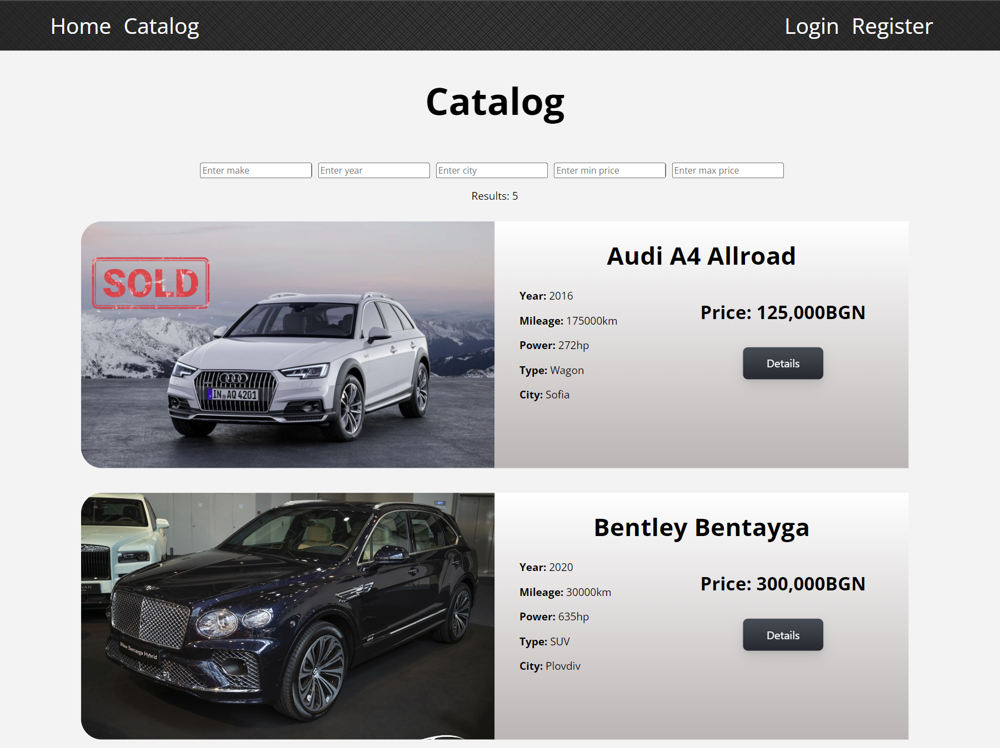

# Second Shift Auto

Welcome to Second Shift Auto! 🚗💨

This Angular application serves as a platform for listing and selling cars. It incorporates both user and guest functionalities, providing a seamless experience for everyone involved.

## Features

### Guest Features:
- **Login & Registration:** Guests can create accounts or log in to access additional features.
- **Browse Vehicles:** Guests can view all vehicles listed on the platform.
- **Filtering:** Ability to filter vehicles based on various criteria.

### User Features:
- **Add Vehicles:** Users can add new vehicles to the platform.
- **Edit Vehicles:** Users can edit details of vehicles they have added (not yet sold).
- **Delete Vehicles:** Users can remove vehicles they have added from the platform.
- **Purchase Vehicles:** Users can buy vehicles listed by other users that are not yet sold.
- **Profile Page:** Users have access to a profile page where they can:
  - View personal profile information.
  - See a list of cars they've added and bought.
  - Check total profit from sales and total costs from purchases.

## Tech Stack

- **Frontend:** Angular v16
- **Backend:** Express.js
- **Database:** MongoDB

## Getting Started

1. **Clone the Repository:**
2. **Install Dependencies:**
3. **Set Up Backend:**
- Ensure MongoDB is installed and running.
- Navigate to the backend directory and run 'npm start'
4. **Start the Application:**
- Navigate to the client directory and run 'ng serve' 
5. **Access the Application:**
Open your browser and navigate to `http://localhost:4200`.

Happy Car Shopping! 🚙🎉

## Screenshots

